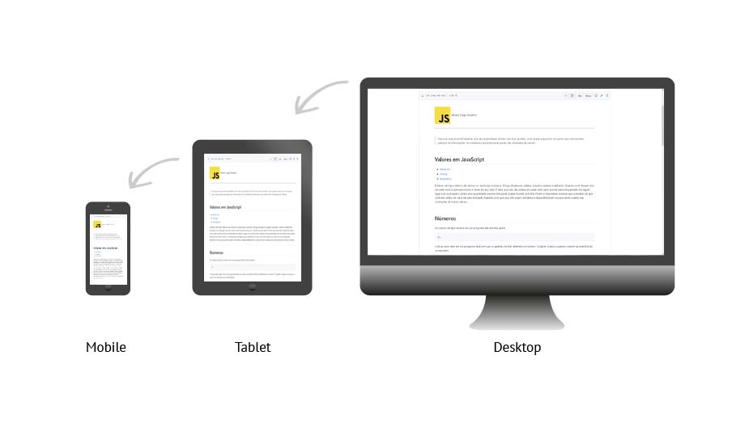
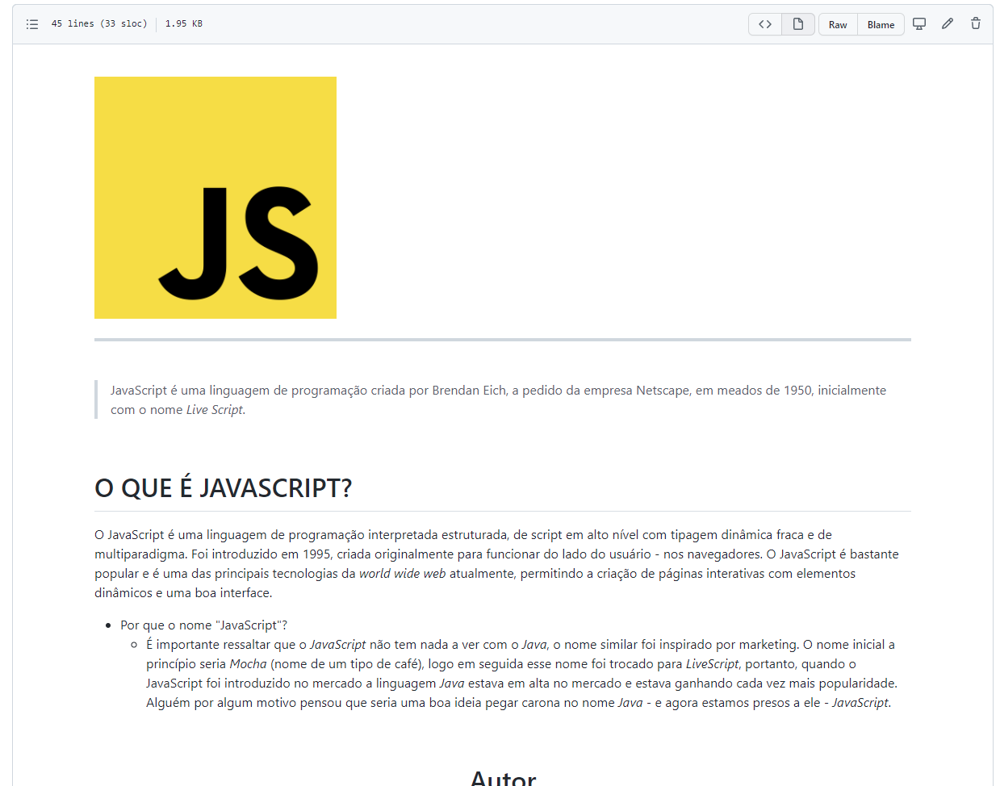
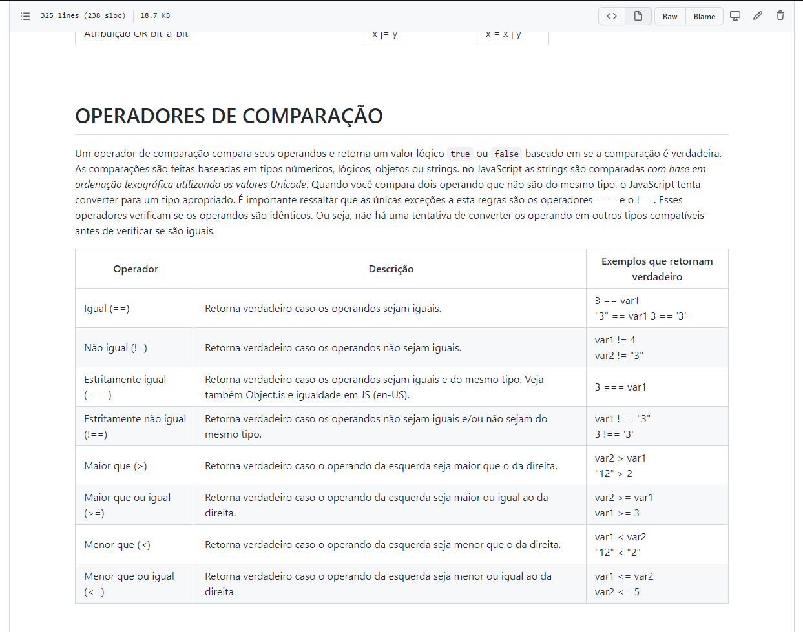
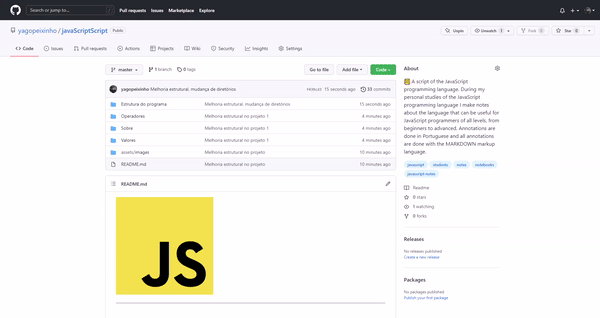

     

---

 
 

**JavaScript Script** é um roteiro de estudo da linguagem de programação JavaScript recomendado para todos os níveis de programadores.

 

# POR QUE ESSE PROJETO EXISTE?

Esse projeto tem iniciativa de um estudante de tecnologia que sentiu a necessidade de fazer anotações sobre a linguagem JavaScript e viu que esse documento poderia ser divulgado para que outros estudantes/programadores também ter possam acesso a esse conteúdo.

 

# GALERIA

 

 

# NOTAS DO PROJETO
Esse projeto está em constante desenvolvimento, a medida em que eu vou estudando vou atualizando esse repositório. Caso encontrem erros de português ou alguma incoerência lógica, por favor, me notifiquem com um e-mail ou pelas minhas redes sociais que podem ser encontradas [clicando aqui](#https://beacons.ai/yagopeixinho). Também estou aberto para ajudar quem desejar com dúvidas e recebo sugestões de melhorias.

 

# RECOMENDAÇÕES

- É fortemente recomendado que você possua um conhecimento mínimo em lógica de programação ou conhecimento básico da linguagem JavaScript antes de ler esse documento
- Esse documento pode ser lido com qualidade (e facilidade) em seus dispositivos móveis como _smarthphone_ ou _tablets_
- Caso você tenha dúvida de como usar o JavaScript Script, [clique aqui](#como-ler-o-javascript-script).

 

# COMO USAR O JAVASCRIPT SCRIPT?

Para rodar o projeto e conseguir ler o documento na verdade é **BEM SIMPLES**. basta clicar nas pastas do projeto e clicar em um dos documento _markdown_. Arquivos _markdown_ são documentos com a finalização `md`, como por exemplo: `operadores.md` que esteja dentro do projeto, como mostra o _gif_ abaixo:

 

# CONTATO

Se você gostou do projeto ou tem alguma crítica construtiva em relação ao projeto ou quer entrar em contato por qualquer outro motivo ou só quer ajudar de alguma forma o projeto, abaixo tem algumas opções:

- 🌎 Compartilhe esse repositório com seus amigos :D
- ⭐ Se gostou da ideia você pode fazer um fork ou favoritar o projeto
- 📬 Me envie um e-mail caso você precise de algo: peixinhoyago@gmail.com

 

# COLABORADORES

<table align="center">
    <tr>
        <td align="center"> 
		    <a href="https://github.com/yagopeixinho">
			        
   
		        
				    <b>Yago Peixinho</b>
		        
		    </a> 
	    </td> 
    </tr>
</table>
